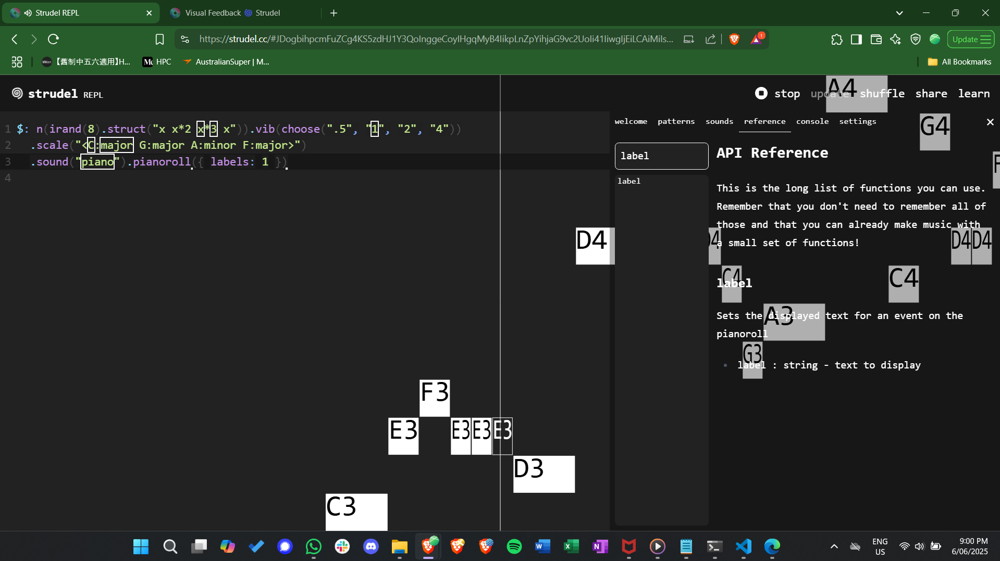
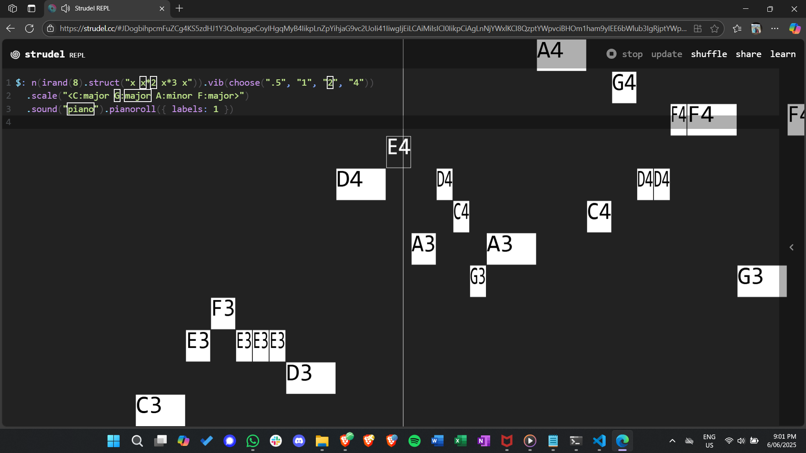
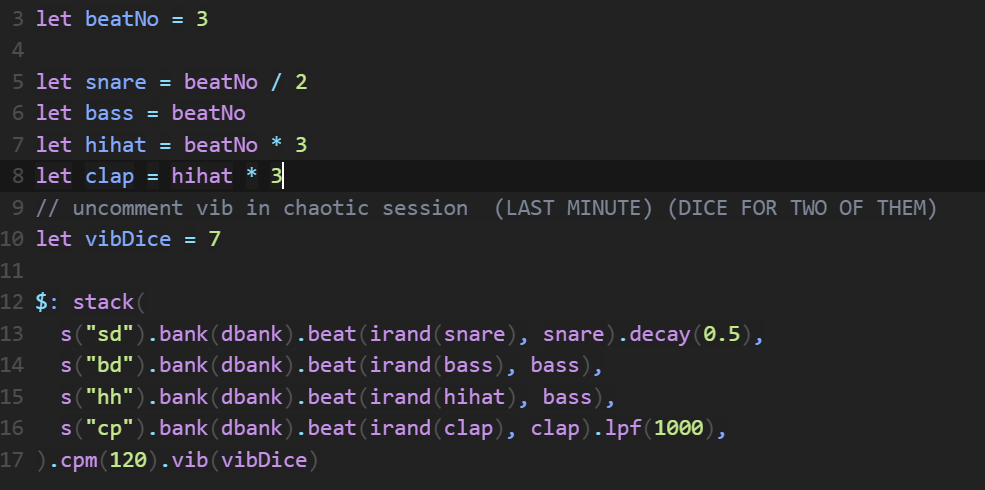
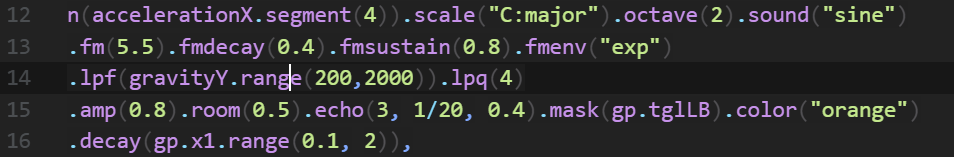
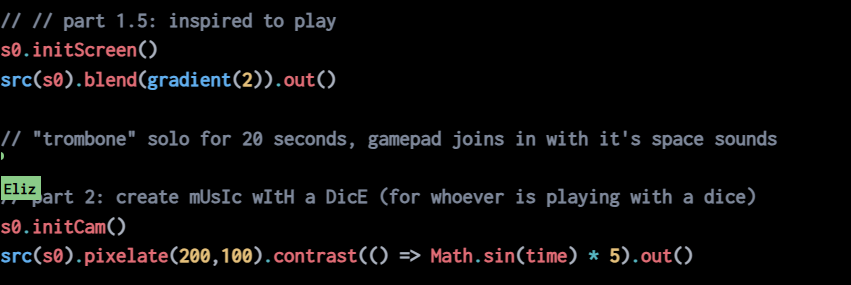
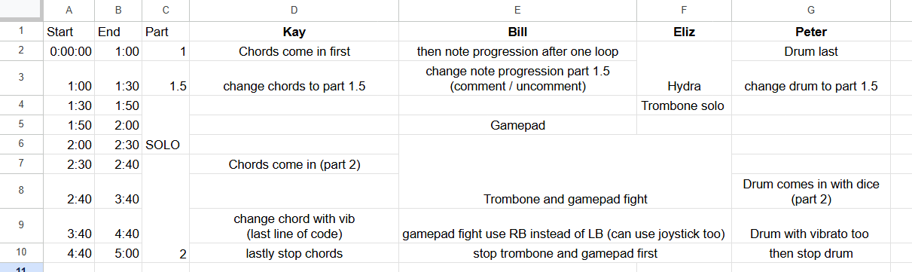
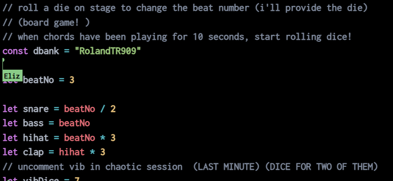
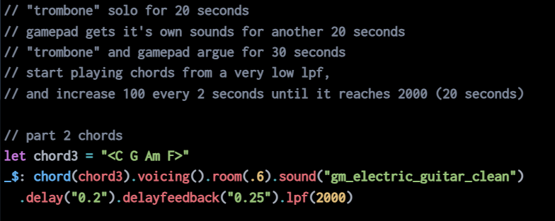
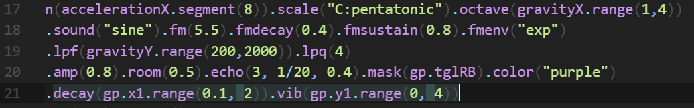
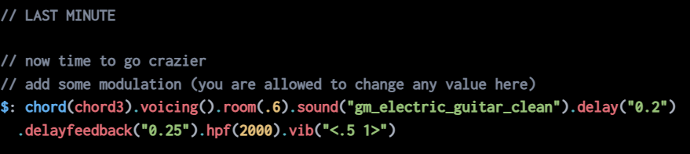

# LENS Performance Documentation

## Inspired at Home - Description
In this performance, I took inspiration from what actually happened at home when I was younger. I would be interested to learn a new instrument from listening to music or watching people playing music instruments like the first minute and half of the performance. Then, I would try to learn it, visualised by the manic playing of the trombone slide. However, my brother would be annoyed because he wanted to watch television or play video games in peace. So, he would be gaming with loud volume, as shown with a gamepad controlled by Bill. Since I only had one younger brother at the time, but now with 2 younger brothers, I decided to envision what my youngest brother would do. He might have attempted to join the playful argument by playing boardgames loudly, attempting to get attention from the both of us. Therefore, Peter was rolling a dice (a 12 faced one) to play the role. My parents would usually try to break my brother and I from our fight, talking to both of us in the background. This is what Kay is representing with the chords, unnoticable with everything that is happening in the performance, but would be different without his part. It gets more chaotic in the end, with more modulations as a nod to week 9's diary.

## Composition

When composing the piece, I started with what I had done in the previous weeks' diary. For instance, week 8's diary was composed with a melody, chord progression, drumline and some weird space sounds. And in week 9's diary, there were quite a lot of modulations that were used. Referencing from both of the diaries, I created a simple template in week 10's diary. A few bass lines and drum lines to randomise with, along wih chords. The chords were referencecd to my current favourite cantopop, The Death of a Lovestruck Brain [1]. 

Afterwards, I started to incorporate the features that I was inspired by. In week 9, while doing the group project, we realised that `irand()` was not a truly randomising function. In fact, it was worse than the other pseudorandom algorithms, such as Python which uses PRNG with a seed that is defaulted to the system's current time [2]. Every time we played, we ended up with the same melody, as shown in the figures below. Figure 1 was captured at 9:00pm on Brave browser, Figure 2 was captured at 8:58pm on Microsoft Edge. Yet as shown in the pictures, they generate the same note. 

So, to spice the beat up in the arguing section (part 2 of the piece), I decided to not only use the `irand()` function to determine the number of beats, but to also use a dice to randomise how many beats it should have in a bar. 

Given that in Pure Data, it was easy to hide everything with a patch, and allow users to control sounds with bangs, toggles and slides, I want to replicate that on Strudel. A way to do it was with a controller. I could let my teammate know what the triggers, buttons and joysticks control, so that it is more user-friendly. However, as stated in my week 10's diary, Flok does not support controllers. So, the code would have to be separate on Strudel. 

Next, to visualise the argument between learning an instrument and gaming, I decided to use an actual instrument so that the audience can understand better. I've considered multiple instruments, such as piano, trumpet, guitar, etc. But going from the audience perspective, it is easier for the audience to see if the action is big. "Playing" any of the above instruments have limited movements. Thus, a trombone was used in this performance. Just like how a trombone slide would change the notes, and an expressive trombonist would move their body around, the acceleration of the device mimics the slide change and thus change of notes, and the gravity of the device changes the low frequency pass. 

Since I would like the gamepad and the trombone to have an argument, I decided to put the code for both in the same strudel file. So that the gamepad could stop the trombone playing with a toggle, annoying the trombone player. 

To show that the music initially inspired me to learn an instrument, I decided to show a video of an orchestra performance with Hydra by sharing my screen. Then, to let audience see that Peter was playing the dice, I used Hydra to turn on our cameras and display it on the screen with an effect. 

Overall, in this project, I value how both music and visuals can convey a story, and most importantly, how I can show the audience instead of telling them. 

## Setup
The setup of the performance requires 4 laptops, where we only need 1 to be outputting the audio from Flok and from Zoom. Next, we need a smartphone which can be put onto this trombone slide connected with a phone holder. The smartphone will support device motion sensors and have to be connected wirelessly (or wired) with a controller. Next, for better sounding and visual, the smartphone will connect to Zoom and share it's screen. All laptops would be connected to an HDMI cable to display on a bigger screen. The order of the laptops would not matter.  

If possible, it is suggested that there is a stopwatch or a phone in front of the players, so that they know what to play at each part. 

In the middle of the performance, whoever has the trombone solo is recommended to turn their cameras onto the player who is rolling the dice. That way, the audience will be able to see what the player is doing.
## Usage

To collaborate on this piece, I have generated a table that can be used like a music score in traditional ensembles. It denotes what needs to be played at different time. The table is saved as a pdf in the materials folder as [timeline.pdf](materials/timeline.pdf). This can be considered as a "conductor's score"

Understanding that the pdf might be too brief for users to understand during the performance, comments are added to remind the users what needs to be changed, or played at that moment. As if these comments are individual instrument's music score. Some examples are shown below: 

Moreover, it is common that each individual has their own playing style. There are parts of the piece that I designed for the individuals to unleash their creativity in modulating what I currently have. For example, there are some controls on the joystick of the gamepad that can the timbre of the trombone. or that it is not explicitly written what to change in the last minute for the chord progressions. 

This way, each performance with different players can be different while the piece still conveys the same message, same story, with a bit of individuality. 

## References

[1] Guitarians. 2025. The Death of a Lovestruck Brain. Retrieved 12/05/2025 from https://zh-hk.guitarians.com/chord/291886/%E9%99%B3%E5%81%A5%E5%AE%89-%E6%88%80%E6%84%9B%E8%85%A6%E4%B9%8B%E6%AD%BB

[2] Python. 2024. random - Generate Pseudo-random Numbers. Retrieved 06/06/2025 from https://docs.python.org/3/library/random.html